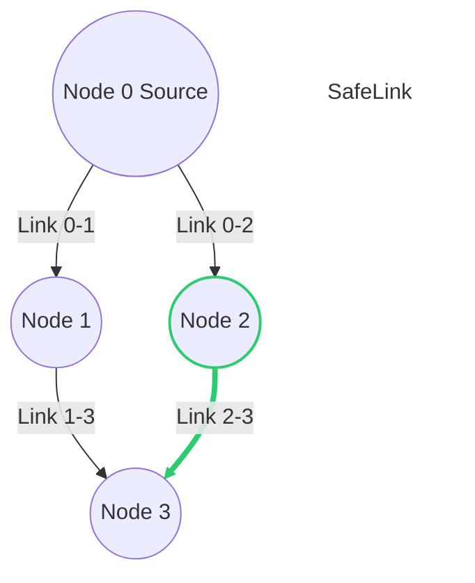

# RL Routing – Real-World Fine-Tuning


This repository implements an **online fine-tuning module** for a reinforcement learning–based routing protocol.

The goal is to transfer a **pre-trained Behavioral Cloning (BC) policy** into a real-world communication testbed using **Proximal Policy Optimization (PPO)**.


## 🛠 Pre-Training (Optional)


We have provided a pre-trained model (`bc_model.pt`) in the root directory, so **you typically do NOT need to run this step.**


However, if you wish to re-train the behavioral cloning model from scratch using the BackPressure expert (Offline Phase), you can run: ```bash
python pretrain_bc.py```

Output: Generates a new bc_model.pt in the root directory.

Next Step: Proceed to Online Fine-Tuning.


## 📂 Repository Structure

```text
rl-routing-deployment/
│
├── bc_model.pt               # Pre-trained behavioral cloning weights (warm-start)
├── train_online.py           # Main script for online PPO fine-tuning
├── requirements.txt          # Python dependencies
├── README.md                 # Project documentation
└── src/
    ├── Actor_Critic.py       # PPO and Actor–Critic network implementation
    ├── grid_routing_env.py   # Simulation environment (replace with testbed wrapper)
    └── utility.py            # Helper functions for logging and metrics
```

---

## 🌐 Network Topology & Assumptions

The current implementation assumes a **4-node network (2×2 grid)**:

* **Node 0**: Source
* **Node 3**: Destination

### Adversary-Free Assumption

The link between **Node 2 → Node 3** is assumed to be **adversary-free**.
The agent is expected to learn to leverage this path for reliable packet delivery.



---

## 🎮 Action Space

The policy outputs a **joint MultiDiscrete action** for all forwarding nodes **simultaneously** at each time step.

**Total Action Space**

```text
MultiDiscrete([7, 4, 4])
```

### Action Breakdown

| Node   | Action Dimension | Description                                                  |
| ------ | ---------------- | ------------------------------------------------------------ |
| Node 0 | 7                | 6 active actions: (Target {1,2}) × (3 power levels) + 1 wait |
| Node 1 | 4                | 3 active actions: (Target {3}) × (3 power levels) + 1 wait   |
| Node 2 | 4                | 3 active actions: (Target {3}) × (3 power levels) + 1 wait   |

**Note:** Power levels correspond to **Low**, **Medium**, and **High** transmission power settings defined in the environment.

---

## 🎯 Reward Function (Online Fine-Tuning)

To balance **throughput** and **reliability** during online adaptation, the recommended reward is:

$$
\text{Reward} = \text{Throughput} \times \text{DEP} \times \text{Coefficient}
$$

* **Throughput**: Amount of data successfully delivered to the destination
* **DEP (Data Delivery Probability)**: Estimated probability of successful packet decoding
* **Coefficient**: Scalar (e.g., `1.0` or `0.1`) for reward normalization and PPO stability

---

## 🚀 Setup & Usage

### 1️⃣ Install Dependencies

```bash
pip install -r requirements.txt
```

### 2️⃣ Load the Pre-Trained Model

Ensure `bc_model.pt` exists in the project root.
This file contains the **warm-start policy trained via Behavioral Cloning**.

### 3️⃣ Run Online Fine-Tuning

```bash
python train_online.py
```

---

## 🔌 Integration with a Real Testbed

To deploy on real hardware:

1. Open `train_online.py`
2. Replace `GridRoutingEnv` with your **hardware interface wrapper**
3. Ensure the wrapper:

   * Produces the same **observation shape**
   * Accepts actions in `MultiDiscrete([7, 4, 4])` format

